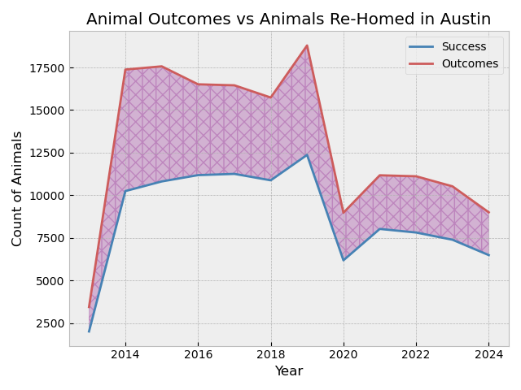

# Group Project: Animal Shelters

## [Part 1: Intro and Data Cleaning](./code/01-data-cleaning.ipynb)
---
### 1. Introduction 

#### Problem Statement
Despite ongoing efforts to increase animal adoption rates in shelters, many animals remain unadopted for long periods. This issue not only affects the well-being of the shelter animals but also strains shelter resources and impacts community perceptions of animal welfare. Various factors, including the breed, age, color, and health status of the animals, as well as the practices and conditions within the shelters, play a crucial role in determining adoption outcomes.

The goal of this project is to predict the likelihood of adoption for animals using classification models and identifying specific characteristics that correlate with lower/higher adoption likelihood. When certrain animals fall into the "not adopted" category, it is essential to develop alternative strategies to prevent euthanasia for these at-risk animals and implement targeted interventions such as specialized marketing, behavioral training, foster programs, or partnerships with other rescue organizations.

By understanding the predictors of adoption, shelters can adjust their operational strategies. This will not only improve adoption rates but also ensure that animals receive the care and support to find new homes or alternative solutions, thereby minimizing the incidence of euthanasia and promoting a more humane approach to animal welfare.

The metrics we are looking to optimize are accuracy and specificity, with specificity being the priority. To be production ready accuracy should be above 80% and specificity above 70%.

#### Outcome Definition
Outcome types "adoption", "return to owner", and 'foster' are classified as the positive outcomes, while other outcome types are classified as the negative outcomes.

The ultimate goal is to provide actionable insights for shelters. By pinpointing the most influential features affecting adoption rates, shelters can prioritize their resources and efforts in areas that will yield the highest impact, leading to improved outcomes for animals. Using the classification model to establish a system to predict the intake animals likelihood of adoption, this will help shelters to make necessary adjustments for these animals and to continuously improve adoption rates.

---
#### Data

All data used for this project is from [City of Austin Open Data](https://data.austintexas.gov/) and [City of Dallas Open Data](https://www.dallasopendata.com/). The Austin shelter data is specifically from [Austin Animal Center Intakes](https://data.austintexas.gov/Health-and-Community-Services/Austin-Animal-Center-Intakes/wter-evkm/about_data) and [Austin Animal Center Outcomes](https://data.austintexas.gov/Health-and-Community-Services/Austin-Animal-Center-Outcomes/9t4d-g238/about_data). The Dallas shelter data is from [Dallas Animal Shelter Data Fiscal Year 2014-2015](https://www.dallasopendata.com/Archive/Dallas-Animal-Shelter-Data-Fiscal-Year-2014-2015/4j5h-8vay/about_data), [2015-2016](https://www.dallasopendata.com/Archive/Dallas-Animal-Shelter-Data-Fiscal-Year-2015-2016/bg5d-mj5u/about_data), [2016-2017](https://www.dallasopendata.com/Archive/Dallas-Animal-Shelter-Data-Fiscal-Year-2016-2017/sjyj-ydcj/about_data), [2017-2018](https://www.dallasopendata.com/Services/Dallas-Animal-Shelter-Data-Fiscal-Year-2017-2018/wb7n-sdxi/about_data), [2018-2019](https://www.dallasopendata.com/Services/Dallas-Animal-Shelter-Data-Fiscal-Year-2018-2019/kf5k-aswg/about_data), [2019-2020](https://www.dallasopendata.com/Services/Dallas-Animal-Shelter-Data-Fiscal-Year-2019-2020/7h2m-3um5/about_data), [2020-2021](https://www.dallasopendata.com/Services/Dallas-Animal-Shelter-Data-Fiscal-Year-2020-2021/sq59-vp2t/about_data), [2021-2022](https://www.dallasopendata.com/Services/Dallas-Animal-Shelter-Data-Fiscal-Year-2021-2022/uu3b-ppfz/about_data), [2022-2023](https://www.dallasopendata.com/Services/Dallas-Animal-Shelter-Data-Fiscal-Year-2022-2023/f77p-sgrc/about_data), and [2023-2025](https://www.dallasopendata.com/Services/Dallas-Animal-Shelter-Data-Fiscal-Year-2023-2025/uyte-zi7f/about_data)

|feature|type|description|source|
|---|---|---|---|
|**animal_id**|*str*|Unique animal ID|Austin & Dallas|
|**outcome_time**|*datetime*|Day and time of animal outcome|Austin|
|**date_of_birth**|*datetime*|Animal's date of birth|Austin|
|**outcome_type**|*str*|Outcome of animal|Austin & Dallas|
|**outcome_gender**|*str*|Neuter/spay status at outcome|Austin|
|**outcome_age**|*float*|Animal age at outcome|Austin|
|**intake_time**|*datetime*|Day and time animal is taken in by shelter|Austin|
|**found_location**|*str*|Where animal is found|Austin|
|**intake_type**|*str*|How animal is taken in|Austin & Dallas|
|**intake_condition**|*str*|Animal's health condition upon intake|Austin & Dallas|
|**animal_type**|*str*|Type of animal|Austin & Dallas|
|**intake_gender**|*str*|Neuter/spay status upon intake|Austin|
|**intake_age**|*float*|Animal age in months upon intake|Austin|
|**breed**|*str*|Animal breed|Austin & Dallas|
|**color**|*str*|Animal color|Austin|
|**stay_duration**|*str*|How many days animal is in shelter before outcome|Austin & Dallas|
|**spay_neuter**|*int*|1 if an animal is spayed or neutered while in the shelter|Austin|
|**reason**|*str*|Why an animal is taken in by a shelter|Dallas|
|**outcome_condition**|*str*|Animal's health condition upon outcome|Dallas|

### 2. Data Cleaning

The data from both Austin and Dallas required cleaning before being ready to analyze and model. They both had columns identifying the intake and outcome dates of each pet that needed to be sorted and converted to the correct data type. The Austin data had to be appropriately combined with the same animal ID's matching their income and outcome dates. The Dallas data needed to be combined for each year that was reported, each animal's intake and outcome were already matched. We also made the decision to drop columns that we felt wouldn't impact the outcome of an animal (e.g. name, 

## [Part 2: Exploratory Data Analysis](./code/02-eda-final.ipynb)
---

### 3. Exploratory Data Analysis

Overall Dallas has more pets in their shelters, they also euthanize a larger percentage of these animals. This could be due to space constraints since they are taking in more animals. The larger disparagy between all outcomes and positive outcomes for Dallas compared to Austin can be seen below.

We also found the most represented breed was overwhelmingly Pit Bull Mixes. This would account for the larger number of this breed being euthanized.

## Part 3: Preprocessing and Modeling
#### [Logistic Regression Prediction Repeat Pets](./code/03.1-repeat_animals-model_tuning.ipynb)
#### [Logistic Regression Predictions](./code/03.2-model-tuning-logistic-regression.ipynb)
#### [Neural Network Predictions](./code/03.3-modeling-neural-networks.ipynb)
---

### 4. Modeling and Evaluation

**Logistic Regression**
* Austin - Iterated several singular Logistic Regression models implementing different subsets of features, best performance achieved when putting the best singular Logistic Regression, a RandomForestClassifier, and an AdaBoostClassifier with a StackingClassifer with another Logistic Regression as the final estimator. The features used in this final model were:
    - animal type (cat or dog)
    - intake age
    - if they get spayed or neutered in the shelter
    - number of days in the shelter before outcome
    - breed
    - intake type
    - intake condition
* Dallas - The data from Dallas did not have as many features to include in the model, tried using all available but ended up getting the best specificity without intake condition. The best performing model was also a StackingClassifier with the same first level estimators and final estimator as Dallas, just with different hyperparameters for regularizing. The remaining features included were:
    - animal type (cat or dog)
    - breed
    - intake type
    - reason for intake
    - number of days in the shelter before outcome

### 
Baseline model

||Accuracy|
|---|---|
|**Austin**|0.63|
|**Dallas**|0.45|
 
### 
Logistic Regression Prediction Performance

||Accuracy|Precision|Specificity|
|---|---|---|---|
|**Austin**|0.83|0.84|0.67|
|**Dallas**|0.74|0.70|0.75|
 
### 
Neural Net Prediction Performance

||Accuracy|Precision|Specificity|
|---|---|---|---|
|**Austin**|0.82|0.84|0.72|
|**Dallas**|0.80|0.71|0.70|

### 5. Conclusion and Recommendations
* For the Austin data set:
    * Overall, both Austin models performed competitively, achieving accuracies of 83% and 82% respectively. These results indicate a strong ability to predict adoption outcomes based on the characteristics of the animals.
    * Model Performance: The logistic regression model outperformed the neural network slightly in accuracy but the neural net had a higher specificity, suggesting that for this particular dataset, the linear relationships captured by logistic regression may be more representative of the adoption dynamics than the more complex relationships modeled by the neural network.
    * Key Characteristics: For the regression models, identifying specific characteristics that correlate with adoption likelihood is crucial(during the feature selection). Factors such as age, breed, spay/neuter, health status may play significant roles in influencing adoption outcomes. Understanding these correlations can guide the development of tailored marketing strategies to highlight animals that may be overlooked.
* For Dallas data set,
    * The intake and outcome records of Dallas shelters come with less information compared to the Austin shelter, which is a challenge for our models due to the limited information.

#### Future improvements:
For the data aspect, we could collaborate with local shelters to gather more detailed information. Continuous monitoring of adoption outcomes and the effectiveness of implemented strategies will be vital. Additionally, exploring other classification models or ensemble methods could provide further improvements in prediction accuracy and insight.

There are potential functionalities we can add to help shelters:
* If shelters can provide more detailed animal descriptions, we can utilize the text features for prediction by adding more NLP to the model.
* The animal records also contain breed information. If shelters also include images, we can add image classification functionality to recognize breed and animal types.
* With further model improvements with more detailed and consistent data collection between different city's shelters, further functionality can be added to the simple [prediciton streamlit app](./code/prediction-probabilities-app.py) provided to not only predict an animal's outcome but also make recommendations for which specific cities they would have better chances in.